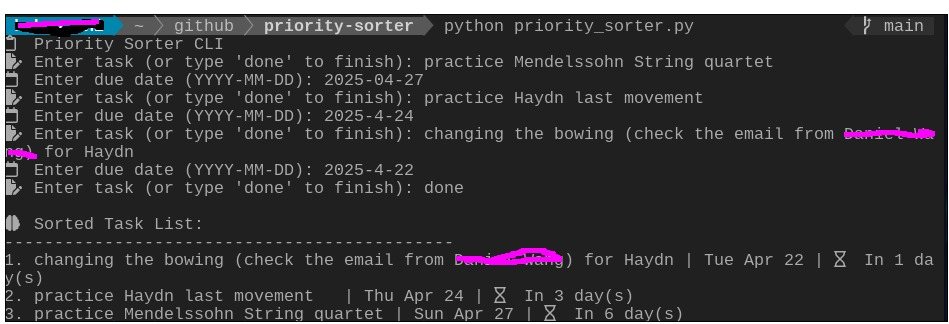

## Background & Motivation 🧠

I'm currently learning about lists and sorting in Python—things like sorting alphabetically, by numbers, and naturally I got curious about sorting by dates too. That’s how this little project started. 

Honestly, it’s super simple and just something I made to try applying what I've been learning. Instead of trying to build something fancy or useful for others, I wanted to see what I could actually make and use myself, with the basics I know so far.

---

# 📋 Priority Sorter CLI

A simple Python command-line tool that helps you organize tasks based on due dates.  
This script automatically calculates how many days are left and sorts your to-do list by urgency.

---

## 🔧 Features

- Add any number of tasks with due dates
- Automatically calculates days remaining
- Sorts tasks from most urgent to least
- Highlights:
  - ❗ Overdue
  - 🔥 Due today
  - ⏳ Coming soon

---

## ▶️ How to Use

1. Make sure you have Python 3 installed
2. Run the script in your terminal:

## 🧪 Sample Output

🧠 Sorted Task List:
---------------------------------------------
1. Submit application          | Mon Apr 22 | 🔥 DUE TODAY
2. Renew passport              | Wed Apr 24 | ⏳ In 2 day(s)
3. Pay subscription            | Thu Apr 18 | ❗ OVERDUE

 

